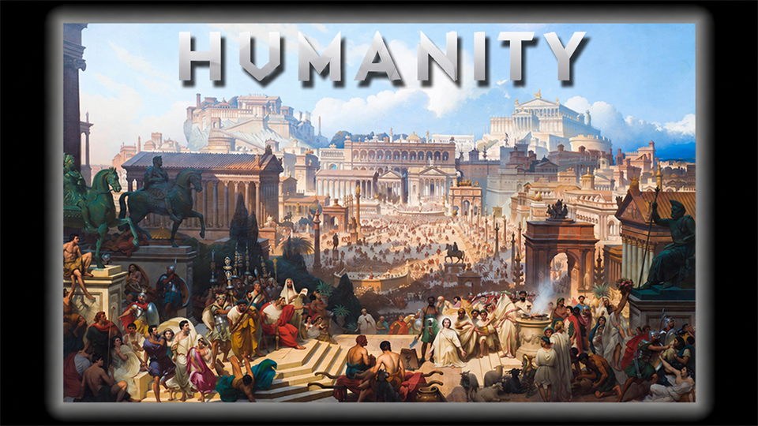

# Humanity

<p align="center"></p>

**Humanity** — игра с двумя режимами: **«Кочевники»** и **«Вторая мировая»**. В кочевниках игроки выживают, строят поселения и развивают цивилизацию от каменного века. Во Второй мировой Германия и СССР сражаются за контроль над точкой. Режим выбирается голосованием; для Второй мировой карта случайно выбирается между **«Лагерем»** и **«Опушкой»**. Повторы возможны.

**[Наш Discord](https://discord.gg/zRPUHmaEE)** — общение, предложения и сообщения об ошибках.

## Как проходит бой

- Три минуты на подготовку: выберите роль, вооружитесь и соберите отделение.
- Для стрельбы из длинного оружия нужен хват в две руки. Нажмите **E**; предмет из второй руки упадёт на землю.
- Удерживайте точку четыре минуты, чтобы победить.
- Подкрепления доступны каждые две минуты.
- Если за 45 минут никто не захватил точку, побеждает сторона с большим числом убийств противника. При равном счёте — ничья.

Подробности — во внутриигровом справочнике (F1).

## Кочевники

Добывайте ресурсы, создавайте инструменты, стройте мастерские и объединяйтесь во фракции. Эпохи меняются автоматически; опыты за столом исследований ускоряют развитие. Подробности — во внутриигровом справочнике (F1).

## Сборка и запуск

Нужны **Git**, **Python 3** и **.NET SDK 10**. Команды выполняются из корня репозитория.

```powershell
git submodule update --init --recursive
dotnet build Content.Server -c Release
dotnet build Content.Client -c Release
```

Запуск сервера с настройками Humanity:

```powershell
dotnet run --project Content.Server -c Release --no-build -- --config-file Resources/ConfigPresets/Civ/production.toml
```

В другом терминале запустите клиент и подключитесь к `localhost`:

```powershell
dotnet run --project Content.Client -c Release --no-build
```

На Windows можно использовать `START_SERVER.bat` и `START_CLIENT.bat`. После изменения исходников сначала повторите сборку.

В конфигурации включено голосование между двумя режимами. По умолчанию запускается Вторая мировая. Кочевники используют свою карту, Вторая мировая — случайную карту из своего пула. Сохранение мира, голосование за карту и отладочные настройки отключены. Боковые чёрные поля убраны настройкой `viewport.maximum_width = 64`. Для публичного сервера настройте адрес, авторизацию и рекламу в хабе в `Resources/ConfigPresets/Civ/production.toml`.

## Участие в разработке

Об ошибках сообщайте в Discord или задачах репозитория: опишите действия для повторения и приложите журнал при сбое запуска.

Тексты для игроков пишем на русском с учётом контекста. Новые C# файлы размещаем в каталоге `Humanity` соответствующего проекта.

## Лицензии

Код репозитория распространяется по лицензии [MIT](LICENSE.TXT). Это относится к исходному коду SS14 и последующим изменениям.

Большинство ресурсов распространяется по лицензии [CC BY-SA 3.0](https://creativecommons.org/licenses/by-sa/3.0/), если рядом с ресурсом не указано иное. Сведения об авторах и лицензиях находятся в `meta.json` и `attributions.txt`.

Часть ресурсов использует [CC BY-NC-SA 3.0](https://creativecommons.org/licenses/by-nc-sa/3.0/) или другие лицензии, запрещающие коммерческое использование. Для коммерческого использования такие ресурсы потребуется исключить или получить разрешение правообладателей.

Ресурсы из Civ13 распространяются по лицензии [GNU AGPLv3](https://opensource.org/license/agpl-v3). Условия для конкретных файлов указаны в сопроводительных сведениях об авторах и лицензиях.
